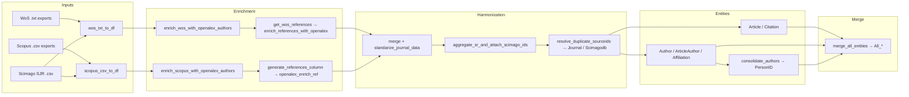

# BibFusion


**BibFusion** is a Python package for **integrating, deduplicating, and harmonizing** exported bibliographic records from **Scopus** and **Web of Science (WoS)** into a single, normalized, analysis-ready relational dataset for bibliometric and scientometric research.

It parses raw exports, enriches them with metadata from the **OpenAlex** API, resolves duplicates across sources, and emits a set of clean CSV tables (`Article`, `Author`, `Citation`, `Affiliation`, `Journal`, `Scimagodb`, …) that can be loaded directly into any analysis tool or graph database.

> ⚠️ **Status:** under active development. Public APIs and internal structures may change between releases.

---

## Table of Contents

- [What it does](#what-it-does)
- [Architecture](#architecture)
- [Requirements](#requirements)
- [Installation](#installation)
- [Configuration](#configuration)
- [Usage](#usage)
- [Input files](#input-files)
- [Outputs](#outputs)
- [Project structure](#project-structure)
- [Testing](#testing)
- [Citation](#citation)
- [License](#license)

---

## What it does

Given raw exports from **WoS** (`.txt`) and/or **Scopus** (`.csv`), BibFusion runs an end-to-end preprocessing pipeline that:

1. **Parses** exports into pandas DataFrames with a normalized, source-agnostic schema.
2. **Normalizes** text fields to ASCII uppercase and standardizes identifiers (DOI, ISSN, author names, ORCID).
3. **Enriches** records with OpenAlex metadata (authors, ORCIDs, author/work IDs, affiliations, abstracts, references).
4. **Links references** to build a directed citation network (`SR` → `SR_ref`).
5. **Harmonizes journals** against a SCImago Journal Rank (SJR) dataset, filling missing ISSN/EISSN and attaching journal-level metrics.
6. **Deduplicates** and merges WoS + Scopus records into consolidated `All_*` tables.
7. **Consolidates authors** into person-level identities (`AuthorPerson`, `AuthorAlias`, `AuthorConflicts`) to power author-level analyses.

The final outputs follow a relational model you can join with primary keys:

| Entity | File | Purpose |
|---|---|---|
| Article | `Article.csv` | Canonical work-level records (query results + reference-only works) |
| Author | `Author.csv` | Author records with stable `AuthorID` / `PersonID` |
| ArticleAuthor | `ArticleAuthor.csv` | Authorship links (`SR` ↔ `AuthorID`) preserving author order |
| Citation | `Citation.csv` | Directed citation edges (`SR` → `SR_ref`) |
| Affiliation | `Affiliation.csv` | Author–affiliation records with extracted countries |
| Journal | `Journal.csv` | Normalized journal outlets with stable `journal_id` |
| Scimagodb | `Scimagodb.csv` | Journal-level metrics (SJR, quartiles, H-index, …) joined by `journal_id` |

---

## Architecture

BibFusion is built as an **orchestrator + modular functions** design:

- **`src/bibfusion/pipeline.py`** — the single entry point `preprocessing_df()` that drives the whole flow and logs each step with execution time.
- **`src/bibfusion/modules/`** — 30+ small, focused functions grouped into *WoS*, *Scopus*, and *common/shared* responsibilities.
- **`src/bibfusion/__main__.py`** — CLI entry point (`bibfusion` command).



### Tech stack

| Layer | Technology |
|---|---|
| Language | Python ≥ 3.11 |
| Data handling | pandas, numpy |
| Fuzzy matching | rapidfuzz (journal/ISSN/title matching) |
| HTTP / enrichment | requests (OpenAlex API) |
| Packaging | setuptools / `pyproject.toml` |

---

## Requirements

- **Python 3.11 or newer** (`python --version`)
- **pip** (bundled with Python)
- An internet connection for OpenAlex enrichment (optional but recommended)
- [Optional] An **OpenAlex API key** to raise rate limits — see [Configuration](#configuration)

---

## Installation

### 1. Clone the repository

```bash
git clone https://github.com/ladmepaz/bibfusion
cd preprocessing
```

### 2. Create and activate a virtual environment

```bash
# Windows (PowerShell)
python -m venv .venv
.venv\Scripts\Activate.ps1

# macOS / Linux
python -m venv .venv
source .venv/bin/activate
```

### 3. Install the package

```bash
python -m pip install --upgrade pip
pip install -r requirements.txt
pip install -e .
```

`pip install -e .` installs BibFusion in *editable* mode so the `bibfusion` CLI command is available and code changes take effect immediately — recommended for development and research use.

### 4. Verify the installation

```bash
python -c "import bibfusion; print(bibfusion.__version__ if hasattr(bibfusion, '__version__') else 'OK')"
```

> 💡 **Tip:** If you only need the package (not the source), run `pip install .` instead of `pip install -e .`.

---

## Configuration

### OpenAlex API key (recommended)

BibFusion uses the free [OpenAlex API](https://openalex.org) to enrich records. An API key is **optional**, but without one you are limited to the default unauthenticated rate limit (~100 credits/day). An authenticated key grants up to 10,000 credits/day.

1. Request a key at **https://openalex.org** (see the [OpenAlex docs](https://docs.openalex.org/how-to-use-the-api/rate-limits-and-authentication)).
2. Export it as an environment variable:

```bash
# Windows (PowerShell)
$env:OPENALEX_API_KEY = "your-key-here"

# macOS / Linux
export OPENALEX_API_KEY="your-key-here"
```

3. Pass it to the pipeline (see [Usage](#usage)). Use the environment variable — **never hard-code keys** in scripts you may share or commit.

> ⚠️ **Security:** Do not commit real API keys. The pipeline accepts the key as a parameter; wire it from an environment variable or a local config file.

### Input datasets

- **Scimago CSV** — a SCImago Journal Rank export (see [Input files](#input-files)). The file `data/scimago.csv` is **not tracked in git** (it is large/external); provide your own or download it from scimagojr.com.
- **Country codes CSV** — shipped at `data/country.csv` with columns `Name;Alpha-2;Alpha-3`.

---

## Usage

### Python API (recommended)

```python
import os

from bibfusion import preprocessing_df

preprocessing_df(
    path_wos=r"C:\data\wos_export.txt",          # single file or list of files
    path_scopus=r"C:\data\scopus_export.csv",    # Scopus CSV export
    path_scimago=r"C:\data\scimago.csv",         # SCImago journal metrics
    path_country=r"C:\data\country.csv",         # country codes
    API_KEY_OPENALEX=os.getenv("OPENALEX_API_KEY"),
)
```

Parameters:

| Parameter | Type | Required | Description |
|---|---|---|---|
| `path_wos` | `str` or `list[str]` | No* | Path(s) to WoS `.txt` export file(s). If a list, all files are merged. |
| `path_scopus` | `str` | No* | Path to the Scopus `.csv` export file. |
| `path_scimago` | `str` | Yes | Path to the SCImago SJR `.csv`. |
| `path_country` | `str` | Yes | Path to the country-codes `.csv`. |
| `API_KEY_OPENALEX` | `str` | No | OpenAlex API key (recommended). |

\* At least one of `path_wos` / `path_scopus` must be provided. Each source is processed independently into its own results folder; if both are provided, they are additionally merged into `All_*` tables.

### CLI

```bash
bibfusion
```

> ⚠️ **Note:** the CLI currently runs the pipeline with hard-coded paths baked into `src/bibfusion/__main__.py`. For everyday use, prefer the Python API above.

---

## Input files

| Source | Required format | Notes |
|---|---|---|
| **Web of Science** | Plain-text `.txt` export | Export with **Full Record and Cited References**, tab-delimited. Multiple `.txt` files in a list are merged. |
| **Scopus** | `.csv` export | Standard Scopus CSV export with all information enabled (select 'All' fields, including references) |
| **Scimago** | `.csv` | Columns expected: `Rank, Sourceid, Title, Type, Issn, eIssn, SJR, SJR Best Quartile, H index, Total Docs. (1999), Total Docs. (3years), Total Refs., Total Citations (3years), Citable Docs. (3years), Citations / Doc. (2years), Ref. / Doc., %Female, Overton, SDG, Country, Region, Publisher, Coverage, Categories, Areas, year, journal_abbr`. |
| **Country codes** | `.csv` | Columns: `Name;Alpha-2;Alpha-3` (ISO-3166). |

> ⚠️ **Data hygiene:** since OpenAlex DOI coverage is partial, some reference records will not be enriched. Rows without DOIs are kept but may carry fewer enriched fields.

---

## Outputs

Results are written next to your input files:

```
your_data_folder/
├── WoS_results/          # generated when path_wos is provided
│   ├── Article.csv
│   ├── Author.csv
│   ├── ArticleAuthor.csv
│   ├── Citation.csv
│   ├── Affiliation.csv
│   ├── Journal.csv
│   ├── Scimagodb.csv
│   ├── AuthorPerson.csv          # person-level consolidation
│   ├── AuthorAlias.csv
│   ├── AuthorConflicts.csv
│   └── *temp_*.csv               # intermediate artifacts (debugging)
├── Scopus_results/       # generated when path_scopus is provided
│   └── (same table layout as WoS_results)
└── all_data_wos_scopus/  # generated when BOTH sources are provided
    ├── All_Articles.csv
    ├── All_Authors.csv
    ├── All_ArticleAuthor.csv
    ├── All_Citation.csv
    ├── All_Affiliation.csv
    ├── All_Journal.csv
    └── All_Scimagodb.csv
```

The pipeline prints the elapsed time of each step, so you can spot slow stages (OpenAlex enrichment is typically the bottleneck due to API rate limits).

---

## Project structure

```
preprocessing/
├── pyproject.toml          # package metadata & build config
├── requirements.txt        # pinned runtime dependencies
├── data/
│   ├── country.csv         # ISO-3166 country codes
│   └── scimago.csv         # SCImago journal metrics (untracked, provide your own)
├── src/bibfusion/
│   ├── __init__.py         # public API (preprocessing_df)
│   ├── __main__.py         # CLI entry point
│   ├── pipeline.py         # main orchestrator
│   └── modules/            # WoS / Scopus / shared functions
├── tests/                  # test scripts (see below)
└── docs/                   # data dictionary & pipeline docs
```

---

## Testing

The `tests/` directory contains script-level tests (e.g., `tests/wos_df_test.py`) that parse a sample WoS export in `tests/files/`.

Run from the repository root:

```bash
python tests/wos_df_test.py
```

> ⚠️ The tests are ad-hoc scripts rather than a pytest suite. If you rely on them, check the import paths first — they may need updating to the current module names (e.g., `wos_txt_to_df`).

---

## Citation

If you use BibFusion in your research, please cite:

> Britto, A., Robledo, S., & Zuluaga, M. (2026). *BibFusion: A Python package to integrate, deduplicate, and harmonize exported bibliographic records from Scopus and Web of Science for bibliometric analysis.* Iberoamerican Journal of Science Measurement and Communication, 6(1), 1–21. DOI: [10.47909/ijsmc.342](https://doi.org/10.47909/ijsmc.342)

A machine-readable citation is available in [`CITATION.cff`](CITATION.cff).

---

## License

MIT — see [LICENSE](LICENSE).
